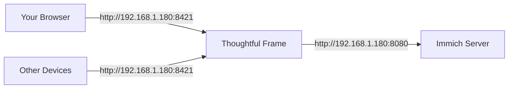

# Thoughtful Frame

A journaling app for your Immich photo library

## Features

- Write journal entries about individual photos or groups of photos
- Browse your Immich photo library in a grid layout
- Multi-select photos to write a single group journal entry
- Chronological journal feed (diary-style)
- Group entries display a horizontal scrollable row of photos
- Edit and delete entries at any time
- Immich API key stays server-side (never exposed to browser)
- Optional app password to restrict access on your local network

## Requirements

- Running Immich server (local network, self-hosted)
- Immich API key (Immich → Account Settings → API Keys)
- Docker

## 🔒 Security

### App Password (Recommended)

By default, anyone on your local network who can reach the app's port can use it. To restrict access, set an `APP_PASSWORD` in your `.env`:

```env
APP_PASSWORD=your_password_here
```

When set:
- Visiting the app redirects to a login page
- A session cookie (HttpOnly, SameSite=Strict) is issued on successful login and lasts 30 days
- All API routes return `401 Unauthorized` without a valid session
- Removing `APP_PASSWORD` disables auth entirely (backwards compatible)

### What's Protected by Default

| Concern | Status |
|---|---|
| Immich API key exposed to browser | ✅ Never — server-side only |
| API key committed to Git | ✅ `.env` is gitignored |
| Unauthorized access from local network | ⚠️ Set `APP_PASSWORD` to restrict |

## 🌉 Your Unraid Network Setup

### Current Configuration

**✅ Your Setup:**
- **Unraid Server IP:** `192.168.1.180`
- **Immich URL:** `http://192.168.1.180:8080/api`
- **Network Mode:** `bridge` (main Unraid network)
- **Thoughtful Frame Port:** `8421`

### How It Works



Both services run on your Unraid server's main bridge network.

### Why This Works Well

**✅ Benefits:**
- **Simple setup**: Uses standard bridge networking
- **Easy access**: Both services on same server IP
- **No port conflicts**: Different ports (8421 vs 8080)
- **Standard configuration**: Works with default Unraid settings
- **Easy troubleshooting**: Direct IP communication

**⚠️ Considerations:**
- Both services must run on different ports
- Firewall must allow both ports
- No container-to-container optimization (uses external URLs)

## 🎯 Unraid-Specific Deployment Guide

### ✅ Pre-Configured for Your Setup

This application is now **pre-configured** to work with your Unraid server:
- **Server IP:** `192.168.1.180`
- **Immich Port:** `8080`
- **Network:** Bridge mode (default Unraid network)
- **Port:** `8421` (Thoughtful Frame)

### 🚀 Quick Start (3 Simple Steps)

#### **1. Copy the project to your Unraid server**
```bash
# Connect via SSH or use Unraid terminal
cd /mnt/user/appdata/

# Clone the repository (or download ZIP and extract)
git clone https://github.com/your-repo/thoughtful-frame.git
cd thoughtful-frame
```

#### **2. Set up your configuration**
```bash
# Copy the example configuration (pre-configured for your Unraid)
cp .env.example .env

# Edit the .env file
nano .env
```

**Simple configuration (only 1 required value):**
```env
# Your Immich API key (REQUIRED - get from Immich settings)
IMMICH_API_KEY=your_actual_api_key_here

# Recommended: set a password to restrict access on your network
APP_PASSWORD=your_password_here

# Optional overrides (most users don't need to change these):
# IMMICH_BASE_URL=http://192.168.1.180:8080/api
# DATABASE_PATH=/data/thoughtful_frame.db
```
```

**Save the file:** Press `Ctrl+X`, then `Y`, then `Enter`

#### **3. Deploy with Docker**
```bash
# Build and start the container
docker compose up -d --build
```

Wait about 30 seconds for initialization...

#### **4. Access Thoughtful Frame**
Open your web browser and navigate to:
```
http://192.168.1.180:8421
```

**Access from other devices on your network:**
```
http://your-unraid-ip:8421
```
(Replace `your-unraid-ip` with your actual Unraid server IP if different from 192.168.1.180)

#### **4.5. Volume Configuration (Optional)**

**How it works:**
```yaml
# Simple bind mount - creates ./data directory automatically
volumes:
  - ./data:/data
```

**What gets stored:**
- `./data/thoughtful_frame.db` - SQLite database file
- All application data persists across container restarts

**Benefits:**
- ✅ **Automatic setup** - No configuration needed
- ✅ **Persistent storage** - Data survives container updates/restarts
- ✅ **Easy backups** - Just copy the `./data` directory
- ✅ **Simple migration** - Move the directory to any location

**To change volume location:**
```bash
# 1. Stop container
docker compose down

# 2. Move existing data (if any)
mv ./data /mnt/user/appdata/thoughtful-frame/data

# 3. Edit docker-compose.yml
nano docker-compose.yml

# 4. Change volume mount:
# From: - ./data:/data
# To:   - /mnt/user/appdata/thoughtful-frame/data:/data

# 5. Restart
docker compose up -d
```

#### **5. Verify It's Working**
```bash
# Check container status
docker ps

# View logs (should show no errors)
docker logs thoughtful-frame

# Test the health endpoint
curl http://localhost:8421/api/health

# Test Immich connection from container
docker exec -it thoughtful-frame curl http://192.168.1.180:8080/api/server-info
```

#### **6. Docker Health Checks**

The container includes **automatic health monitoring** (similar to the reference application):

```yaml
# Health check configuration (from Dockerfile)
HEALTHCHECK --interval=30s --timeout=10s --retries=3 --start-period=15s
    CMD python -c "import urllib.request; urllib.request.urlopen('http://localhost:8000/api/health')"
```

**Monitoring Commands:**
```bash
# Check health status (Unraid/Docker)
docker inspect --format='{{.State.Health.Status}}' thoughtful-frame

# View full health details
docker inspect thoughtful-frame | grep -A 20 "Health"

# Monitor health events in real-time
watch -n 1 "docker ps --format 'table {{.Name}}\t{{.Status}}\t{{.Health}}'"

# Manual health check
curl http://localhost:8421/api/health
```

**Health Check Configuration:**
- **Interval:** 30 seconds (same as reference)
- **Timeout:** 10 seconds (same as reference)
- **Retries:** 3 attempts before unhealthy (same as reference)
- **Start Period:** 15 seconds grace period (same as reference)
- **Endpoint:** `/api/health` (comprehensive status)

**Matches Reference Application:**
- ✅ Same health check interval (30s)
- ✅ Same timeout (10s)
- ✅ Same retry count (3)
- ✅ Same start period (15s)
- ✅ Similar Python-based health check
- ✅ JSON-file logging with rotation

**Example Healthy Response:**
```json
{
  "healthy": true,
  "status": {
    "timestamp": "2024-03-11T06:17:25.450123",
    "database": "ok",
    "immich": "ok", 
    "application": "ok",
    "details": {
      "database": "connection successful",
      "immich": "connection successful (0.45s)",
      "application": "running"
    }
  },
  "timestamp": "2024-03-11T06:17:25.450123",
  "version": "1.0.0"
}
```

#### **3. Configure Environment Variables**
```bash
# Copy the example configuration
cp .env.example .env

# Edit the .env file (use nano or your preferred editor)
nano .env
```

**Fill in these values:**
```env
# Your Immich server URL (use container name if on same Docker network)
IMMICH_BASE_URL=http://immich_server:2283/api

# Your Immich API key (from Immich Account Settings → API Keys)
IMMICH_API_KEY=your_api_key_here

# Leave this as-is for default database location
DATABASE_PATH=/data/thoughtful_frame.db
```

**Save the file:** Press `Ctrl+X`, then `Y`, then `Enter`

#### **4. Find Your Immich Network**

Since you want to use the same network as Immich:

```bash
# List all Docker networks and find your Immich network
docker network ls
```

Look for a network name like:
- `immich_immich` (common default)
- `immich_default` 
- `your-stack-name_immich`
- Or any network containing "immich"

**Note the exact network name** - you'll need it for the next step.

#### **5. Configure Docker Network**

```bash
# Edit docker-compose.yml
nano docker-compose.yml
```

Find the networks section (around line 20):
```yaml
networks:
  - thoughtful-frame-network
```

Replace it with your Immich network name:
```yaml
networks:
  - your-immich-network-name
```

Also **remove** the `networks:` section at the bottom of the file.

**Example:** If your Immich network is `immich_immich`:
```yaml
networks:
  - immich_immich
```

#### **6. Configure for Your Unraid Setup**

Since you're using the main bridge network and Immich is at `192.168.1.180:8080`:

```bash
# Edit your .env file
nano .env
```

**Use your actual Immich URL:**
```env
# Your Unraid server IP and Immich port
IMMICH_BASE_URL=http://192.168.1.180:8080/api

# Keep the API key from your Immich settings
IMMICH_API_KEY=your_actual_api_key_here

# Database path (leave as default)
DATABASE_PATH=/data/thoughtful_frame.db
```

**Save the file:** Press `Ctrl+X`, then `Y`, then `Enter`

**Option C: Share Immich's Network (Advanced)**
If you want Thoughtful Frame to communicate directly with Immich:
```bash
# Find your Immich network name
docker network ls | grep immich

# Edit docker-compose.yml
nano docker-compose.yml
```

Replace the network section with your Immich network name:
```yaml
networks:
  - your-immich-network-name
```

And remove the `networks:` section at the bottom.

#### **5. Start the Application**
```bash
# Build and start the container
docker compose up -d --build
```

Wait about 30 seconds for initialization...

#### **6. Access Thoughtful Frame**
Open your web browser and navigate to:
```
http://YOUR_UNRAID_IP:8421
```

Replace `YOUR_UNRAID_IP` with your Unraid server's local IP address.

#### **7. Verify It's Working**
```bash
# Check container status
docker ps

# View logs (helpful for troubleshooting)
docker logs thoughtful-frame

# Test the health endpoint
curl http://localhost:8421/api/health
```

### 🎯 Troubleshooting Tips

**Problem:** "Cannot reach Immich server" (Your Setup)
- ❌ Check `.env` file has correct URL:
  ```bash
  cat .env | grep IMMICH_BASE_URL
  ```
  Should show: `IMMICH_BASE_URL=http://192.168.1.180:8080/api`

- ❌ Test Immich connectivity from host:
  ```bash
  curl http://192.168.1.180:8080/api/server-info
  ```

- ❌ Test from Thoughtful Frame container:
  ```bash
  docker exec -it thoughtful-frame curl http://192.168.1.180:8080/api/server-info
  ```

- ❌ Check firewall allows port 8080:
  ```bash
  telnet 192.168.1.180 8080
  ```

- ❌ Verify Immich is running:
  ```bash
  docker ps | grep immich
  ```

**Your Setup Specific:**
- ✅ **Simple bridge networking** - uses standard Unraid network
- ✅ **Direct IP communication** - no Docker DNS needed
- ✅ **Easy to debug** - standard network tools work
- ⚠️ **Both services on same server** - ensure no resource conflicts

**Quick Fixes:**
- **Port conflict?** Change Thoughtful Frame port in docker-compose.yml
- **Firewall blocking?** Check Unraid firewall settings for port 8080
- **Immich not responding?** Restart Immich container first

**Problem:** Database errors
- ❌ Check file permissions: `chmod -R 777 /mnt/user/appdata/thoughtful-frame/data`
- ❌ Verify `DATABASE_PATH` in `.env` points to writable location

**Problem:** Port conflicts
- ❌ Change host port in `docker-compose.yml` if 8421 is in use
- ❌ Restart container after changes: `docker compose restart`

### 📱 Using the Application

1. **Journal Tab** - View all your entries in chronological order
2. **Photos Tab** - Browse your Immich photo library
3. **Create Entries** - Click any photo or select multiple photos to write about
4. **Edit/Delete** - Click any entry to view full details and make changes

### 🔧 Updating the Application

```bash
# Stop the container
cd /mnt/user/appdata/thoughtful-frame
docker compose down

# Pull the latest changes
git pull

# Rebuild and restart
docker compose up -d --build
```

### 📊 Monitoring and Logs

Thoughtful Frame includes comprehensive logging to help troubleshoot issues:

```bash
# View real-time logs with colors (follow)
docker logs -f thoughtful-frame

# View last 200 lines of logs
docker logs --tail 200 thoughtful-frame

# View logs with timestamps
docker logs -t thoughtful-frame

# Filter logs by level (show only ERROR and above)
docker logs thoughtful-frame | grep -E 'ERROR|WARNING'

# Save logs to file for analysis
docker logs thoughtful-frame > thoughtful-frame.log

# Check container status
docker ps | grep thoughtful

# View resource usage (CPU, memory)
docker stats thoughtful-frame

# View detailed log information
docker inspect thoughtful-frame --format='{{.LogPath}}'
```

**Understanding Log Output:**
```
# Example log line format:
2024-01-15 14:30:45 - thoughtful-frame - INFO - main.py:25 - Application starting up...
          ↑                ↑                  ↑           ↑               ↑
          timestamp       logger name        level      module:line     message

# Common log patterns:
- "Application starting up..." - Normal startup
- "Database initialized successfully" - DB ready
- "Creating new entry with X assets" - User activity
- "Failed to fetch assets from Immich" - Integration issue
- "Database operation failed" - Query problems
```

**Log Analysis Tips:**
- 🔍 **Search for ERROR** to find critical issues
- 📊 **Count log levels**: `docker logs tf | grep -c "ERROR"`
- ⏱️ **Measure response times**: Look for timing logs
- 🔗 **Correlate requests**: Use request IDs in access logs
- 📁 **Archive logs**: Rotate regularly to prevent disk issues
=======

**Enhanced Log Features:**
- ✅ **Verbose DEBUG logging** for detailed troubleshooting
- ✅ **Automatic log rotation** (10MB max, keeps 5 files)
- ✅ **Structured format with module/line numbers** for precise debugging
- ✅ **Colorized console output** for better readability
- ✅ **Access logs** with detailed request/response information
- ✅ **Error logs with stack traces** for deep diagnostics
- ✅ **Tagged and labeled logs** (`thoughtful-frame`) for easy filtering
- ✅ **Lifespan event logging** (startup/shutdown)
- ✅ **Database operation logging** with timing
- ✅ **Immich API call logging** with payload details

**Log Levels Used:**
- `DEBUG` - Detailed operational information (database queries, API calls)
- `INFO` - Important runtime events (startup, health checks, endpoint calls)
- `WARNING` - Potential issues (validation failures, retries)
- `ERROR` - Problems that need attention (failed operations, timeouts)

**Common Log Messages:**
- `Database health check failed` - Database connection issues
- `Immich health check failed` - Cannot reach Immich server
- `404 Not Found` - Page or API endpoint not found
- `500 Internal Server Error` - Server-side errors

### 🛠️ Common Issues & Solutions

**Issue: "Cannot reach Immich server"**
```bash
# Check if Immich container is running
docker ps | grep immich

# Test network connectivity from Thoughtful Frame container
docker exec -it thoughtful-frame ping immich_server

# Verify .env configuration
cat .env | grep IMMICH_BASE_URL
```

**Issue: Database permission errors**
```bash
# Fix permissions
chmod -R 777 /mnt/user/appdata/thoughtful-frame/data

# Restart container
docker compose restart
```

**Issue: Port already in use**
```bash
# Find what's using port 8421
netstat -tulnp | grep 8421

# Change port in docker-compose.yml
# Before: - "8421:8000"
# After:  - "8422:8000"

# Recreate container
docker compose up -d --force-recreate
```
=======
=======

## How to Use

- **Journal tab** — chronological feed of all entries
- **Photos tab** — browse Immich library
  - Click a photo → write a single-photo entry
  - Click "Select Multiple" → check photos → "Write Entry" for a group
- **Writing** — optional title + your thoughts → Save
- **Entry detail** — click any feed card → full view with Edit/Delete
- **Multi-photo entries** — horizontal scrollable row; click any image for full-screen

## Health Check

`GET /api/health` returns `{ healthy, database, immich }` status

## 💻 Local Development Setup

### For Beginners: Step-by-Step

#### **1. Install Python**
- Download Python 3.12+ from [python.org](https://www.python.org/downloads/)
- Make sure to check "Add Python to PATH" during installation

#### **2. Set Up Virtual Environment**
```bash
# Create a virtual environment (isolates dependencies)
python -m venv .venv

# Activate it (Windows)\.venv\Scripts\activate

# Activate it (Mac/Linux)
source .venv/bin/activate
```

#### **3. Install Dependencies**
```bash
# Install required packages
pip install -r requirements.txt
```

#### **4. Configure Environment**
```bash
# Copy the example configuration
cp .env.example .env

# Edit .env file (use any text editor)
# Fill in your Immich server details
```

#### **5. Start Development Server**
```bash
# Run with auto-reload (changes apply immediately)
uvicorn backend.main:app --reload
```

#### **6. Access the Application**
Open your browser and visit: [http://localhost:8000](http://localhost:8000)

### 🎯 Development Tips

**Hot Reloading:** The server automatically restarts when you save files

**API Testing:** Try these endpoints:
- `GET /api/health` - Health check
- `GET /api/journal/entries` - List journal entries
- `POST /api/journal/entries` - Create new entry

**Debugging:**
```bash
# View Python logs
# They appear in your terminal where uvicorn is running

# Check installed packages
pip list

# Update dependencies
pip install -r requirements.txt --upgrade
```

**Common Issues:**
- **Port 8000 in use?** Change it: `uvicorn backend.main:app --port 8001 --reload`
- **Missing dependencies?** Run `pip install -r requirements.txt` again
- **Database errors?** Delete `thoughtful_frame.db` and restart
=======